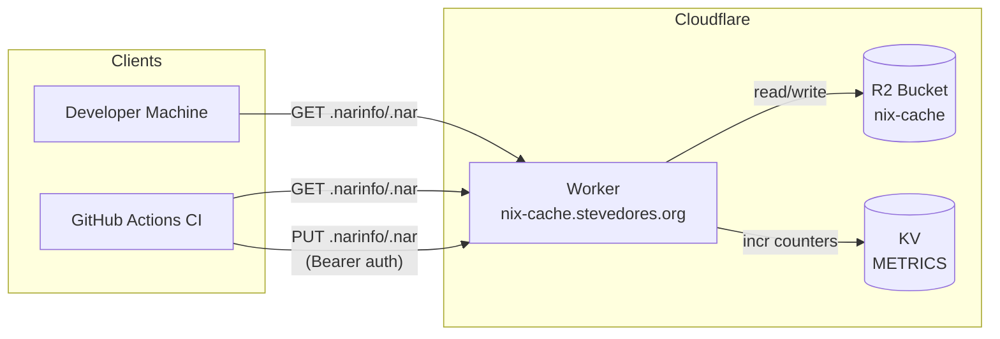

# nix-cache

Nix binary cache Cloudflare Worker backed by R2 storage.

**Live:** https://nix-cache.stevedores.org

## What is this?

A **plain Nix binary cache** (not [Attic](https://github.com/zhaofengli/attic)) backed by Cloudflare R2. It implements the standard Nix binary cache protocol — `nix-cache-info`, `.narinfo`, and `.nar` files served over HTTPS.

**This is NOT an Attic server.** Use `nix copy --to` for uploads, not `attic push`. The `attic-client` package is not needed.

## Architecture



**Data flow:**
- **GET** (public): Nix client requests `.narinfo`/`.nar` → Worker fetches from R2 → returns to client
- **PUT** (authenticated): CI signs store paths → `nix copy --to` uploads to Worker → Worker stores in R2
- **Metrics**: Every request increments KV counters → `/metrics` endpoint returns JSON

## Quick Start for New Repos

Add this to your `flake.nix`:
```nix
{
  nixConfig = {
    extra-substituters = [ "https://nix-cache.stevedores.org" ];
    extra-trusted-public-keys = [ "stevedores-cache-1:bXLxkipycRWproIJnk8pPWNFdgVfeV+I2mJXCoW4/ag=" ];
  };

  # ... rest of your flake
}
```

That's it — Nix will now pull cached builds from `nix-cache.stevedores.org`.

## CI Integration

### Reusable GitHub Actions

This repo provides composite actions. Add to your workflow:

```yaml
jobs:
  build:
    runs-on: ubuntu-latest
    steps:
      - uses: actions/checkout@v4
      - uses: stevedores-org/nix-cache/.github/actions/setup@develop
        with:
          push: ${{ github.event_name == 'push' }}
          cache-auth-token: ${{ secrets.CACHE_AUTH_TOKEN }}
          signing-secret-key: ${{ secrets.NIX_SIGNING_SECRET_KEY }}

      - run: nix flake check

      - uses: stevedores-org/nix-cache/.github/actions/push@develop
        if: github.event_name == 'push'
        with:
          paths: .#default
```

### Action Inputs

| Input | Required | Description |
|-------|----------|-------------|
| `push` | No | Enable cache uploads (default: `false`) |
| `cache-auth-token` | If push | Bearer token for PUT auth |
| `signing-secret-key` | If push | Ed25519 secret key for signing |

### Manual CI Setup

If not using the composite actions:
```bash
echo "$NIX_SIGNING_SECRET_KEY" > /tmp/nix-sign-key
nix store sign --key-file /tmp/nix-sign-key $(nix build .#default --no-link --print-out-paths)
nix copy --to "https://nix-cache.stevedores.org" $(nix build .#default --no-link --print-out-paths)
```

## Secrets Reference

All secrets are stored at **org level** (`stevedores-org` GitHub org settings) and as Cloudflare Worker secrets.

| Secret | Where | Purpose |
|--------|-------|---------|
| `CACHE_AUTH_TOKEN` | GH org + CF Worker | Bearer token for PUT uploads |
| `NIX_SIGNING_SECRET_KEY` | GH org | Ed25519 secret key for signing store paths |
| `NIX_SIGNING_PUBLIC_KEY` | GH org | Public key for reference in CI |

**Public key** (safe to share): `stevedores-cache-1:bXLxkipycRWproIJnk8pPWNFdgVfeV+I2mJXCoW4/ag=`

## Pushing to the Cache

Upload pre-built packages using `nix copy` (the standard Nix protocol):

```bash
# From a developer machine
nix store sign --key-file /path/to/secret-key /nix/store/abc123-mypackage
nix copy --to "https://nix-cache.stevedores.org" /nix/store/abc123-mypackage
```

> **Do NOT use `attic push`** — this is a plain binary cache, not an Attic server.

## API Endpoints

| Endpoint | Method | Auth | Description |
|----------|--------|------|-------------|
| `/` | GET | No | Cache info (`nix-cache-info` format) |
| `/nix-cache-info` | GET | No | Cache info |
| `/health` | GET | No | Health check (JSON) |
| `/metrics` | GET | Bearer | JSON counters (hits, misses, uploads, auth failures) |
| `/<hash>.narinfo` | GET | No | Package metadata |
| `/nar/<hash>.nar` | GET | No | Package archive |
| `/*` | PUT | Bearer | Upload to R2 |

## Monitoring

### Metrics Endpoint

```bash
curl -H "Authorization: Bearer $CACHE_AUTH_TOKEN" https://nix-cache.stevedores.org/metrics
```

Returns:
```json
{
  "get_hit": 142,
  "get_miss": 23,
  "put_ok": 87,
  "auth_fail": 2,
  "get_total": 165
}
```

### Cloudflare Dashboard

- **Worker analytics**: Requests, errors, latency — [CF Dashboard > Workers > nix-cache](https://dash.cloudflare.com/f1be33af27cf878e2e81cb29a0d886f7/workers/services/view/nix-cache/production)
- **R2 storage**: Object count, storage usage — [CF Dashboard > R2 > nix-cache](https://dash.cloudflare.com/f1be33af27cf878e2e81cb29a0d886f7/r2/default/buckets/nix-cache)
- **Observability logs**: Enabled in `wrangler.toml` — visible in CF dashboard under Workers > Logs

## Development

```bash
bun install          # Install deps
bun test             # Run integration tests
bunx tsc --noEmit    # Type check
bunx wrangler dev    # Run locally
local-ci             # Run all CI checks locally (typecheck + test)
```

Deployment is automatic via Cloudflare Workers Builds — pushes to `main` trigger deploys.

## Cloudflare Resources

| Resource | Type | Purpose |
|----------|------|---------|
| `nix-cache` | Worker | Request routing, auth, metrics |
| `nix-cache` | R2 bucket | `.narinfo` + `.nar` storage |
| `METRICS` | KV namespace | Counter storage |
| `CACHE_AUTH_TOKEN` | Worker secret | PUT authentication |

## Key Rotation

```bash
# Generate new keypair
nix-store --generate-binary-cache-key stevedores-cache-2 /path/to/secret /path/to/public

# Update everywhere:
# 1. GitHub org secrets: NIX_SIGNING_SECRET_KEY, NIX_SIGNING_PUBLIC_KEY
# 2. This README (public key references)
# 3. wrangler.toml NIX_PUBLIC_KEY var
# 4. All consuming flake.nix files (extra-trusted-public-keys)
```

## Troubleshooting

| Symptom | Cause | Fix |
|---------|-------|-----|
| `nix build` ignores cache, builds from source | Missing `extra-trusted-public-keys` in `flake.nix` | Add the public key (see Quick Start) |
| `warning: ignoring substitute` | Public key mismatch or missing | Verify key matches `stevedores-cache-1:bXLx...` |
| 404 on `.narinfo` | Store path not cached yet | Push it from CI or manually |
| 401 on PUT | Missing or wrong `Authorization` header | Use `Bearer <CACHE_AUTH_TOKEN>` |
| 403 on PUT | Invalid token | Check `CACHE_AUTH_TOKEN` matches CF Worker secret |
| 500 on PUT | `CACHE_AUTH_TOKEN` not set on Worker | Set it via `wrangler versions secret put` |

## Disaster Recovery

If R2 data is lost, the cache can be repopulated by re-running CI builds on all repos. The cache is a **performance optimization**, not a source of truth — all packages can be rebuilt from source.

```bash
# Trigger rebuilds across all repos
for repo in oxidizedMLX aivcs oxidizedRAG local-ci; do
  gh workflow run ci.yml --repo "stevedores-org/$repo"
done
```

## License

MIT
